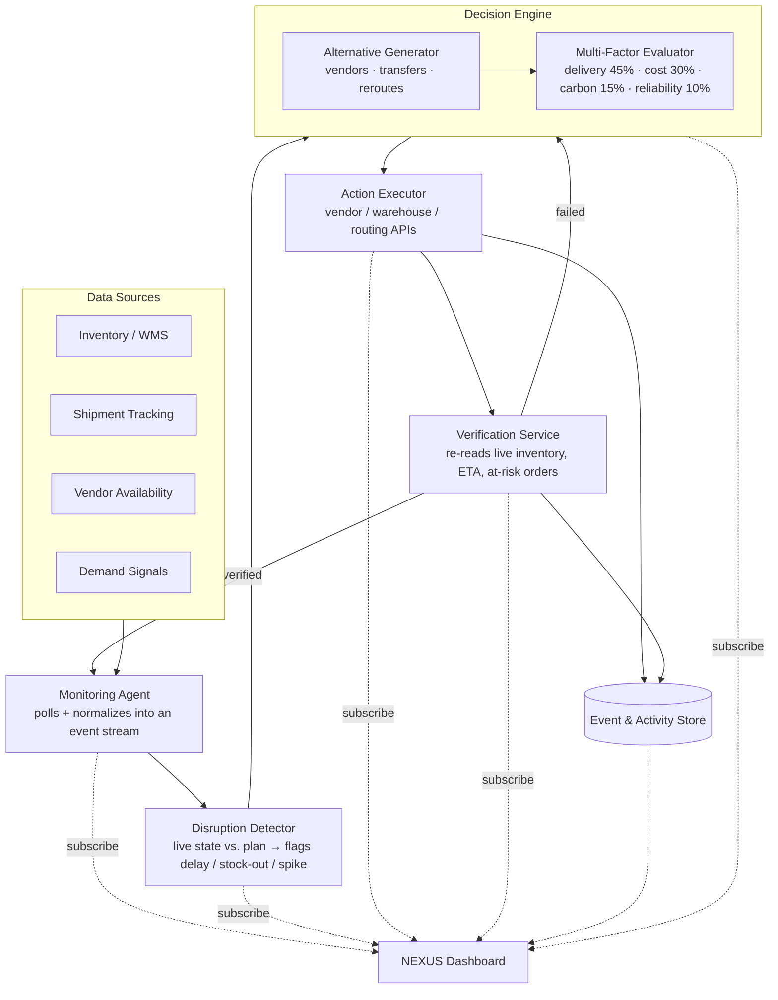

# Architecture — NEXUS

See `architecture-diagram.svg` for the rendered version. Mermaid source below (renders on GitHub):

## Components

| Component | Responsibility | In this build |
|---|---|---|
| **Data Sources** | Inventory, shipment, vendor, demand feeds | Mocked JSON fixtures shaped like real API responses |
| **Monitoring Agent** | Polls sources on an interval, normalizes into a common event stream | Simulated timer loop in `index.html` |
| **Disruption Detector** | Diffs live state against the delivery plan, flags breaks, computes blast radius | Static demo scenario (`SHP-4821`) + a second queued scenario (`SKU-8842`) |
| **Decision Engine** | Generates candidate recoveries, scores them on delivery/cost/carbon/reliability, picks a winner with a confidence score | Pre-scored alternatives rendered in the Alternatives + Decision stages |
| **Action Executor** | Issues the actual writes: reserve stock, create transfer, reassign shipment, notify order system | Animated checklist standing in for the real API calls |
| **Verification Service** | Re-reads system state after action to confirm the fix held, not just that the call succeeded | Before/after cards (inventory, ETA, orders at risk) |
| **Event & Activity Store** | Persists every stage transition for the activity feed and run history | In-memory array in the browser session |
| **NEXUS Dashboard** | Turns the loop into something a human can watch and trust | This repository — `index.html` |

## Why the loop is designed this way

- **Detection is separate from decision.** A disruption is flagged before any fix is proposed, so the "why did it act" question always has a clean trigger to point to.
- **Decision is separate from action.** The weighted scoring step produces a recommendation *and* a reason before anything is executed — this is what stops the agent from being a black box.
- **Verification is separate from action.** Firing the API calls and confirming they worked are treated as two different steps, because "the request succeeded" and "the problem is actually fixed" are not the same claim.
- **The loop closes.** Verification feeds back into monitoring rather than terminating, so a second disruption starts the same loop again without a human restarting anything.

## Path to a real backend

The mock data layer in `index.html` (the `STAGES`, `DISRUPTIONS`, `ALTS`, `NETWORK` objects and the `DEMO_STEPS` sequence) is intentionally shaped like the payloads a real backend would emit at each stage. Swapping in a live system means:

1. Replace the static objects with a WebSocket or polling subscription to the Monitoring Agent's event stream.
2. Feed real `Disruption`, `Alternative`, `Decision`, `ExecutionStep`, and `VerificationResult` events into the same render functions (`renderStage`, `renderDisruptions`, `pushFeed`).
3. No change needed to the loop UI, the demo mode structure, or the visual design — the frontend contract is the event shape, not the transport.
